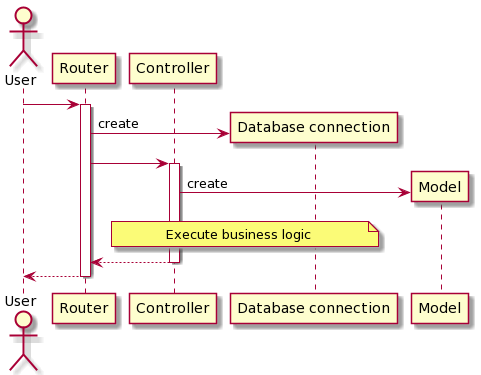

# Hermes

Hermes is a simple messaging service. Hermes allows the sender to post a message and specify a list of recipients. The
sender can also edit the message if required or delete the message. The recipient can check for messages. Using these
operations, messages can be sent by an individual and seen by whomever that individually selects. Hermes is built on the
Fiber framework.

## Architecture

The architecture of Hermes is designed with multiple layers of abstraction. The purpose of this design is to group
similar functions.

### Router Layer

The first layer in the architecture is the Router. The Router has multiple handlers, each of which is in charge of a
specific endpoint. These handlers are responsible for tasks related to the REST API, for example, authentication and
deserializing.

### Controller Layer

The Controller Layer contains all the business logic and conducts the appropriate action for the endpoint. The
controllers are separated from the handlers to facilitate framework independence. This also allows them to be tested
without the added complexity of the API.

### Model Layer

The Model Layer is responsible for the data objects and the functions related to manipulating the data objects. Within
the model layer, the configuration model stores the parameters required for Hermes' to be executed and the code required
to load the configuration.

### Utilities

Supporting these three layers is a set of common utilities such as the code to create database connections. This
architecture pattern closely resembles MVC but has been modified to better suit the development of an API.

## Building and Deployment

Hermes is fully Dockerized. To run Hermes, one must generate the appropriate secrets. These secrets are stored in files
in the secrets folder to be loaded into Docker secrets. It should be noted that this is not the only way of loading
Docker secrets, it is just the simplest way. After all of the secrets are in place, the application can be started using
the Docker-compose up command. This will bring up and configure PostgreSQL, along with Hermes. Hermes is configured to
listen on port 8080 by default. There is a go module file also included to allow Hermes to run without Docker.

## Testing

For the sake of time, Hermes only has the bare minimum set of tests. It has a best path test, for each API endpoint and
specialized tests for the palindrome function. These tests can be run using go test, and they are automatically run
using GitHub actions. Hermes also has some example unit tests for the add user controller. It should be noted that these
tests are not fully working. At the moment sqlmock is rolling back automatically when it should not.

## Environment variables

| Name | Type | Required | Description |--|--|--|--|--| | DB_HOST | String | Yes | Database server host | DB_PORT |
Integer | Yes | Port number for database | MAX_OPEN_CONNS | Integer | Yes | Maximum number of open connections to the
database | MAX_IDLE_CONNS | Integer | Yes | Maximum number of connections in the idle connection pool | DB_PASSWORD_FILE
| File path | Yes | Password for the database | DB_PASSWORD | String | Alternative to DB_PASSWORD_FILE | Password for
the database | DB_USER_FILE | File path | Yes | Username for database | DB_USER | String | Alternative to DB_USER_FILE |
Username for database | DB_NAME | String | Yes | Name of the database | JWT_PRIVATE_KEY_FILE | File path | Yes | PEM
encoded ecdsa private key | JWT_PUBLIC_KEY_FILE | File path | Yes | PEM encoded ecdsa public key | JWT_PRIVATE_KEY |
String | Alternative to JWT_PRIVATE_KEY_FILE | PEM encoded ecdsa private key | JWT_PUBLIC_KEY | String | Alternative to
JWT_PUBLIC_KEY_FILE | PEM encoded ecdsa public key | BCRYPT_COST | Integer | Yes | Number of key expansion rounds should
be tuned to deployment hardware | PEPPER_KEY_FILE | File path | Yes | Pre-hash secret to prevent off-line decoding |
PEPPER_KEY | String | Alternative to PEPPER_KEY_FILE | Pre-hash secret to prevent off-line decoding

## TODO

- [x] Adding users
- [x] Password hashing
- [x] Password checking
- [x] Generation
- [x] GWT verification
- [x] Adding messages
- [x] Deleting messages
- [x] Getting a specific message
- [x] Getting all messages, with user’s access rights
- [x] Input validation
- [x] Text interpretation (palindrome)
- [x] Best path testing
- [x] GitHub access
- [x] Docker deployment
- [X] OpenAPI specification
- [X] Inline comments
- [ ] Diagrams
- [X] Robust error handling
- [ ] Logging
- [ ] Failure mode testing
- [ ] Unit testing
- [ ] Prometheus integration
